# Flujo del relayer

Diagramas del recorrido completo de una metatx por `simple_relay`: validaciones, los dos nonces,
los dos locks, las rafagas, el buffer de reordenamiento y como termina cada caso.

Todo lo que esta aca sale del codigo: `src/relayer.ts` (nucleo), `src/app.ts` (HTTP),
`src/rpc-proxy.ts` (JSON-RPC), `src/gas-model.ts` (forma de la metatx), `src/metatx.ts` (cliente).

---

## 1. Mapa general

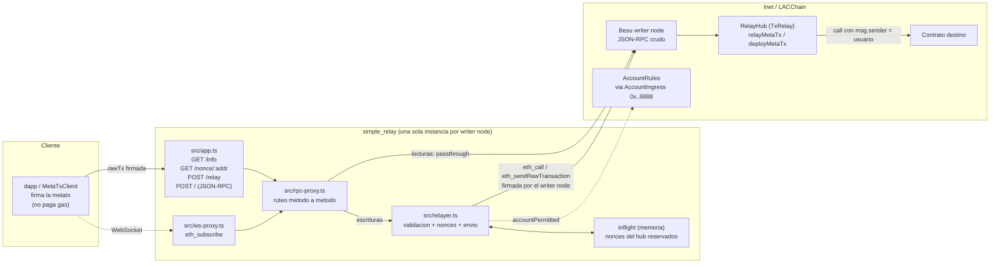

Puntos clave del dibujo:

- El **usuario firma** una tx legacy con `chainId 0` y `gasPrice 0`; nunca toca la cadena.
- El **writer node** es el que firma y manda la tx real (`relayMetaTx`) y el que aparece como
  `msg.sender` frente al hub.
- El **hub** vuelve a poner al usuario como `msg.sender` frente al contrato destino.
- El `RPC_URL` tiene que ser el **JSON-RPC crudo de Besu**, no el relay-signer oficial.

---

## 2. Forma de la metatx

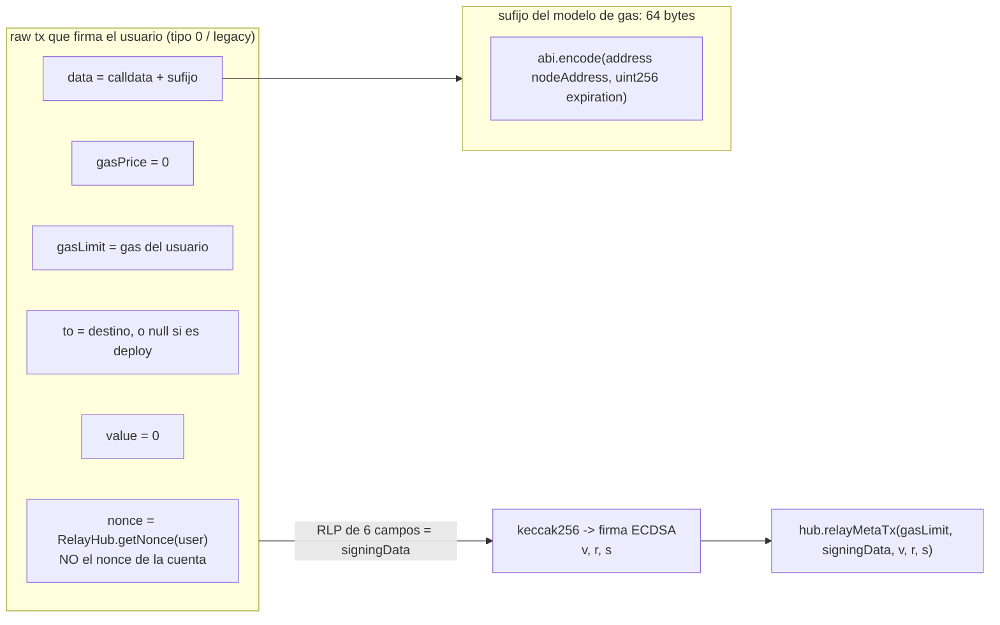

`gasLimit` que va al hub (igual que el relay-signer en Go, `src/gas-model.ts`):

```
metaTxGasLimit = len(data) * 105 + 300000 + gasLimit del usuario
```

---

## 3. Ciclo de vida de una metatx (detallado)

```mermaid
flowchart TD
    IN["rawTx entra<br/>POST /relay o eth_sendRawTransaction<br/>log: relay.received"] --> DES{"Transaction.from(rawTx)<br/>deserializa?"}
    DES -- no --> E1["BAD_RAW_TX"]
    DES -- si --> SHAPE{"validateMetaTxShape<br/>firmada? type 0? chainId 0?<br/>gasPrice 0? value 0? gasLimit > 0?"}
    SHAPE -- "hay problemas" --> E2["BAD_META_TX<br/>details = lista de problemas"]
    SHAPE -- ok --> SUF{"decodeGasModelSuffix<br/>data tiene los 64 bytes<br/>(nodeAddress, expiration)?"}
    SUF -- no --> E3["Error: data too short<br/>(500, no es RelayError)"]
    SUF -- si --> LOGD["log: relay.decoded<br/>from, to, nonce, selector,<br/>metaTxGasLimit, expiresInSeconds"]

    LOGD --> NODEADDR{"ENFORCE_NODE_ADDRESS<br/>nodeAddress == este writer node?"}
    NODEADDR -- no --> E4["WRONG_NODE_ADDRESS"]
    NODEADDR -- si --> EXP{"ENFORCE_EXPIRATION<br/>expiration > now?"}
    EXP -- no --> E5["EXPIRED"]
    EXP -- si --> EXPMIN{"remaining >= MIN_EXPIRATION_SECONDS<br/>menos la tolerancia?"}
    EXPMIN -- no --> E6["EXPIRATION_TOO_LOW"]
    EXPMIN -- si --> RULES{"ENFORCE_ACCOUNT_RULES?"}

    RULES -- "off (default)" --> TURN
    RULES -- on --> PERM{"accountPermitted(from)<br/>cache 30 s"}
    PERM -- "no se pudo leer" --> E7["PERMISSIONING_UNAVAILABLE<br/>fail closed"]
    PERM -- "false" --> E8["SENDER_NOT_PERMITTED"]
    PERM -- "true" --> TURN

    TURN["awaitTurn(from, nonce)<br/>FUERA del lock del usuario<br/>ver diagrama 5"] --> ULOCK["withUserLock(from)<br/>un envio a la vez por usuario"]

    ULOCK --> INFL{"pending >= MAX_INFLIGHT_PER_USER?"}
    INFL -- si --> E9["TOO_MANY_INFLIGHT<br/>(ultima red: el techo ya se<br/>chequeo en la puerta)"]
    INFL -- no --> EXPECT["expectedNonce =<br/>inflight.next si hay cadena,<br/>si no getNonce(from) por eth_call<br/>con from = writer node"]
    EXPECT --> NONCE{"expectedNonce == tx.nonce?"}
    NONCE -- no --> E10["BAD_NONCE<br/>details: expected, got, pending"]
    NONCE -- si --> SIM{"SIMULATE_BEFORE_SEND<br/>y no hay cadena en vuelo?"}

    SIM -- "no: metatx encadenada" --> SEND
    SIM -- si --> STATIC{"eth_call staticCall<br/>relayMetaTx / deployMetaTx"}
    STATIC -- "revierte" --> E11["SIMULATION_FAILED"]
    STATIC -- "errorCode != 8" --> E12["HUB_BADNONCE / HUB_NOTENOUGHGAS<br/>HUB_INVALIDSIGNATURE / ..."]
    STATIC -- "errorCode == 8 (OK)" --> SEND

    SEND["withNonceLock<br/>SECCION CRITICA GLOBAL<br/>ethers pide eth_getTransactionCount(pending)<br/>y manda la tx del writer node"] --> SENT{"el nodo la acepto?"}
    SENT -- no --> E13["SEND_FAILED + hint<br/>forgetInflight(from)"]
    SENT -- si --> RESERVE["inflight[from].next = expectedNonce + 1<br/>pending += 1<br/>cancela el borrado diferido"]
    RESERVE --> LOGS["log: relay.sent<br/>writerNodeNonce, hubNonce,<br/>simulated, pendingForUser"]
    LOGS --> NOTIFY["notifyTurn(from)<br/>despierta a la siguiente de la rafaga"]
    NOTIFY --> RET["devuelve el hash<br/>SIN esperar el receipt"]

    RET --> SETTLE["settle en background<br/>ver diagrama 6"]
    RET --> RESP{"por donde entro?"}
    RESP -- "POST /relay" --> R1["espera settled y responde<br/>el RelayResult completo"]
    RESP -- "eth_sendRawTransaction" --> R2["responde el hash;<br/>el dapp polea el receipt.<br/>El resultado final solo<br/>queda en el log relay.settled"]
```

---

## 4. Los dos nonces y los dos locks

Son dos cosas independientes y es lo que mas confusion genera:

| | quien lo elige | donde vive | como se serializa |
|---|---|---|---|
| nonce de la **metatx** | el usuario, va **firmado** en el RLP | `RelayHub.nonces[writerNode][user]` | `withUserLock` + tracker `inflight` |
| nonce de la **cuenta del writer node** | ethers, al mandar `relayMetaTx` | estado de la cuenta en la cadena | `withNonceLock` global |

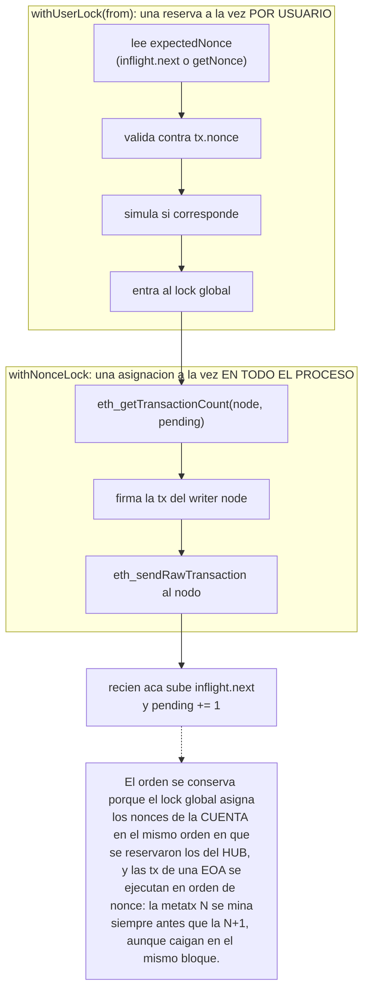

Ninguno de los dos locks abarca la espera del receipt: si la abarcaran, un usuario quedaria
limitado a una metatx por bloque.

---

## 5. Rafaga del mismo usuario

El caso "N metatx concurrentes del mismo usuario". El cliente reparte nonces con un cursor local
y el relayer los encadena.

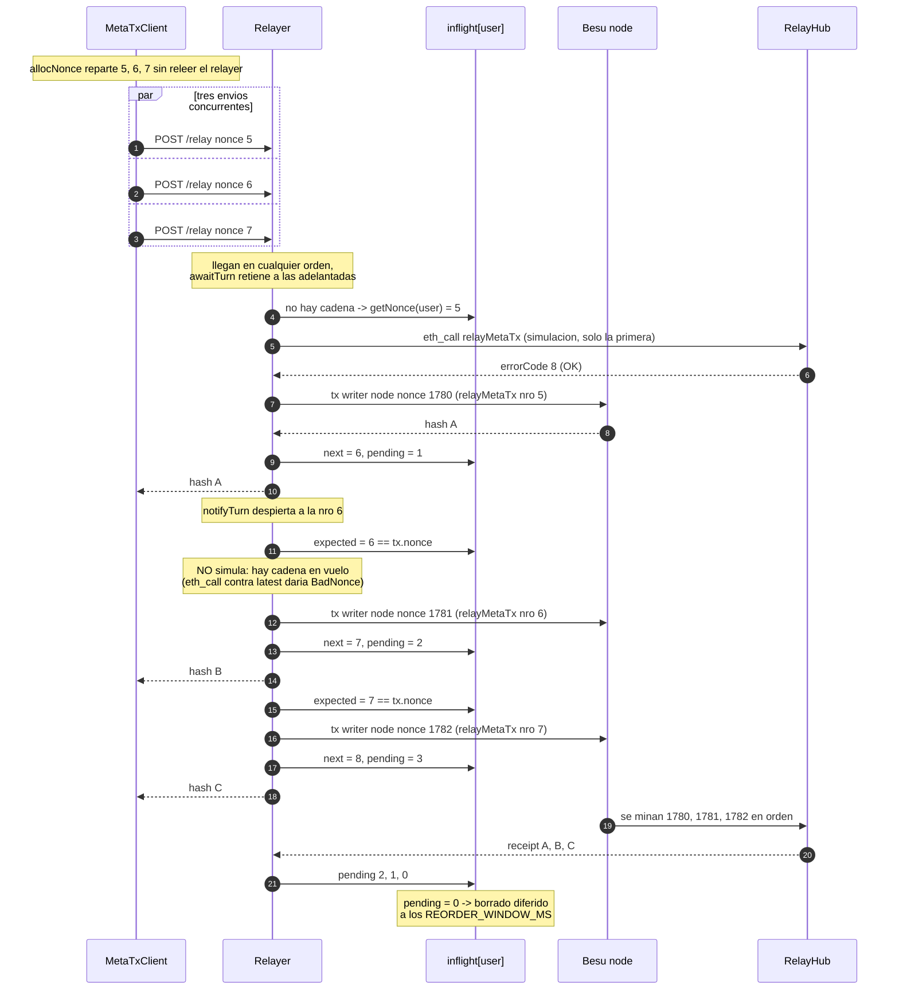

Reglas que se ven en el diagrama:

- **Solo la primera de la rafaga se simula** (`simulated: true`); las encadenadas van sin
  pre-chequeo porque el `eth_call` corre contra `latest`, donde el nonce del hub todavia es viejo.
- El tope de la rafaga es `MAX_INFLIGHT_PER_USER` (`.env` actual: 6, default del codigo: 16).
- El nonce del **hub** avanza de a uno por metatx; el de la **cuenta del writer node** avanza en
  paralelo y es el que traba el txpool si algo se pierde.

---

## 6. `awaitTurn`: buffer de reordenamiento

Sobre HTTP el orden de llegada no esta garantizado y el hub exige el nonce exacto. Una metatx
adelantada espera en vez de morir con `BAD_NONCE`.

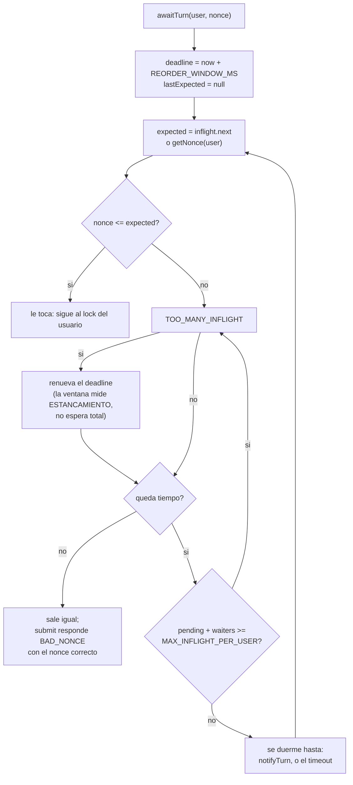

`notifyTurn(user)` se dispara en dos momentos:

- despues de un envio exitoso (el nonce esperado avanzo);
- en `forgetInflight` (la cadena se descarto: hay que reevaluar contra la cadena real).

Si la ventana midiera la espera total, una rafaga larga perderia la cola por reloj: con ~1 s por
envio, la metatx 12 se caeria de una ventana de 3 s mientras el hub va por la quinta.

---

## 7. Estado de la cadena `inflight` de un usuario

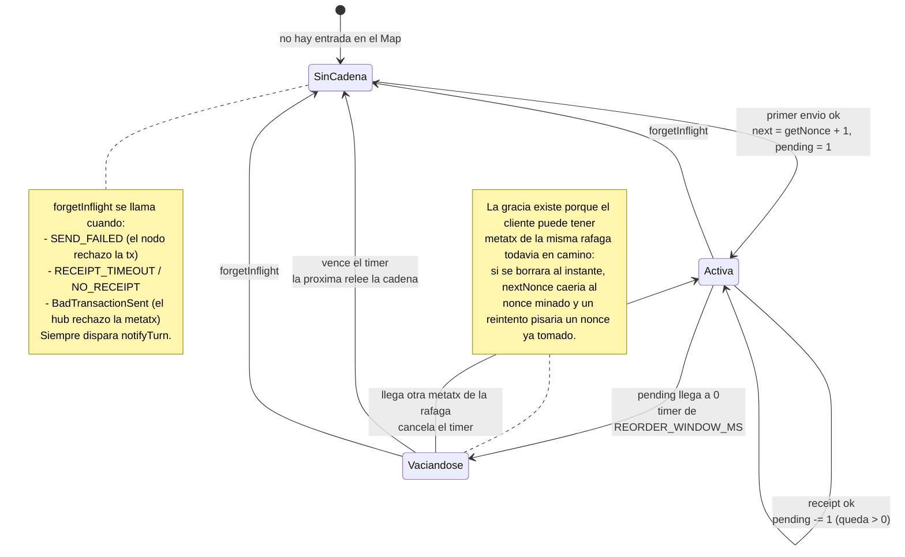

---

## 8. `settle`: que pasa cuando se mina

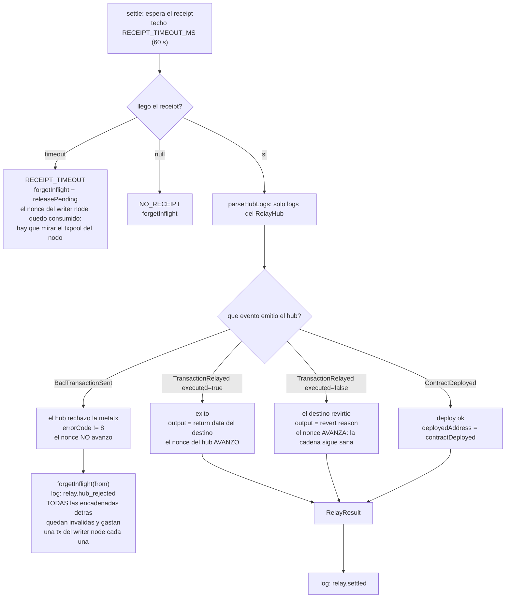

Y para el dapp que polea por JSON-RPC, `enrichReceipt` reescribe el receipt crudo del nodo para
que refleje **su** metatx y no la tx del writer node:

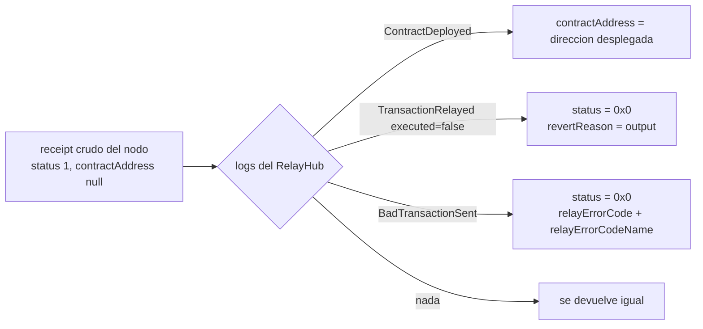

---

## 9. Ruteo del proxy JSON-RPC

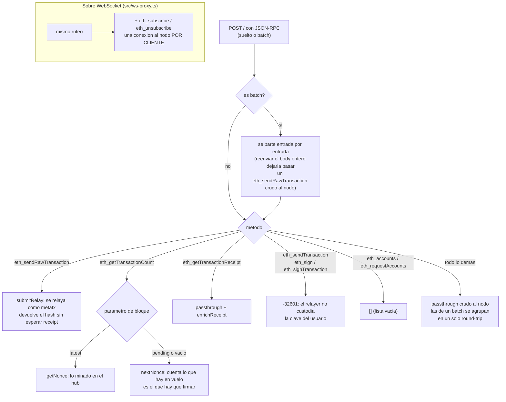

---

## 10. Cliente: cursor de nonce y reintento

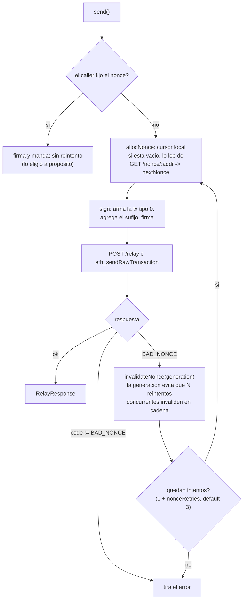

Sin el cursor, N `send()` concurrentes firmarian todos el mismo nonce.

---

## 11. Referencia de errores

Errores del relayer (`RelayError.code`); por REST salen como HTTP 400, por JSON-RPC como `-32000`:

| code | cuando | rompe la cadena de nonces |
|---|---|---|
| `BAD_RAW_TX` | la raw tx no deserializa | no |
| `BAD_META_TX` | no cumple la forma del modelo de gas | no |
| `WRONG_NODE_ADDRESS` | el sufijo apunta a otro writer node | no |
| `EXPIRED` / `EXPIRATION_TOO_LOW` | expiration vencida o al filo | no |
| `SENDER_NOT_PERMITTED` / `PERMISSIONING_UNAVAILABLE` | solo con `ENFORCE_ACCOUNT_RULES=true` | no |
| `TOO_MANY_INFLIGHT` | tope de rafaga por address (enviadas sin receipt + retenidas) | no |
| `BAD_NONCE` | el nonce firmado no es el esperado | no |
| `SIMULATION_FAILED` / `HUB_*` | la simulacion previa dice que el hub la rechazaria | no |
| `SEND_FAILED` | el nodo rechazo la tx del writer node | **si** |
| `RECEIPT_TIMEOUT` / `NO_RECEIPT` | se mando pero no se mino | **si** |

`ErrorCode` del hub (`enum IRelayHub.ErrorCode`, `OK` = 8):

| 0 | 1 | 2 | 3 | 4 | 5 | 6 | 7 | 8 |
|---|---|---|---|---|---|---|---|---|
| MaxBlockGasLimit | BadOriginalSender | BadNonce | NotEnoughGas | IsNotContract | EmptyCode | InvalidSignature | InvalidDestination | **OK** |

---

## 12. Como se ve en el log

Una metatx exitosa deja esta secuencia (cada linea lleva `reqId` e `instanceId`):

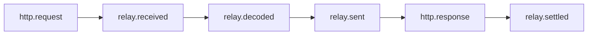

`relay.settled` llega **despues** de la respuesta HTTP en el camino JSON-RPC: es la unica traza
del resultado final de una metatx mandada por `eth_sendRawTransaction`. Variantes:

- `relay.rejected` en lugar de `relay.sent`: se rechazo antes de mandar nada.
- `relay.hub_rejected` antes de `relay.settled`: se mino pero el hub la rechazo.
- `relay.settle_failed`: `RECEIPT_TIMEOUT` o `NO_RECEIPT`.
- `relayer.ready` / `boot`: cold start, tracker de nonces vacio.

---

## 13. Supuestos y limites

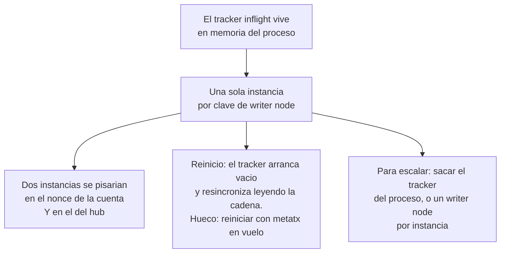

Fuera del relayer, dos cosas dependen de la red y no de este codigo:

- que el **writer node este permisionado** (`addNode` en el hub + `addAccount` en AccountRules);
- que el nodo **propague y mine** lo que acepta: si el nodo encola la tx pero la red no la
  incluye, el sintoma es `RECEIPT_TIMEOUT` con el nonce de la cuenta ya consumido.
